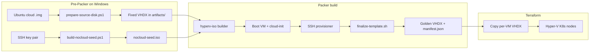

# Packer — Hyper-V Ubuntu image builds

HashiCorp [Packer](https://developer.hashicorp.com/packer) templates in this folder build **generalized Ubuntu Server VHDX images** on a **Windows + Hyper-V** host. The primary output is a **golden template** consumed by [Terraform Hyper-V K8s](../terraform/hyperv-k8s/README.md) to clone Kubernetes node VMs without modifying the original disk.

## Projects

| Directory | Approach | Primary use |
|-----------|----------|-------------|
| [`ubuntu26-hyperv`](ubuntu26-hyperv/) | Ubuntu **cloud image** (QCOW2 → VHDX) + NoCloud seed ISO | **Recommended** — fast, repeatable golden image for clusters |
| [`ubuntu26-hyperv-iso`](ubuntu26-hyperv-iso/) | Ubuntu **live-server ISO** + Subiquity autoinstall over HTTP | Experimental / installer-based builds; separate from cloud-image flow |
| [`ubuntu24-hyperv`](ubuntu24-hyperv/) | Same layout as `ubuntu26-hyperv` | Legacy copy; vars and docs target Ubuntu 26 — prefer `ubuntu26-hyperv` |

## End-to-end flow (recommended path)



### What happens during a build

1. **Prepare source disk** — Downloads the official Ubuntu cloud image (QCOW2), converts it to a **fixed VHDX** with `qemu-img` (see `scripts/prepare-source-disk.ps1`).
2. **Build NoCloud seed** — Injects your SSH **public** key into `nocloud/user-data` and packages `user-data` + `meta-data` into a `cidata` ISO via WSL/`genisoimage` (see `scripts/build-nocloud-seed.ps1`).
3. **Packer `hyperv-iso` builder** — Creates a temporary Gen2 VM:
   - **Primary media**: the cloud VHDX (`cloud_image_url`, usually `file:///...`)
   - **Secondary DVD**: the NoCloud seed ISO (`secondary_iso_images`)
4. **First boot** — cloud-init reads NoCloud config: creates user `ubuntu`, installs `openssh-server`, grows the root disk, enables SSH.
5. **SSH provisioner** — Packer connects with your **private** key and runs `finalize-template.sh`:
   - `cloud-init clean --logs --seed --machine-id`
   - Removes SSH host keys so each clone generates new keys on first boot
6. **Output** — Shutdown and export to `output-ubuntu26-hyperv/` (VHDX under `Virtual Hard Disks/`, plus `manifest.json`).

The ISO variant (`ubuntu26-hyperv-iso`) skips the cloud-image + seed steps: Packer serves `http/user-data` and `http/meta-data`, boots the live-server ISO, and drives **Subiquity autoinstall** via GRUB `ds=nocloud-net`.

## Prerequisites (Windows host)

| Requirement | Used by |
|-------------|---------|
| Hyper-V enabled, virtual switch (default: `hyper-v-switch`) | All builds |
| [Packer](https://developer.hashicorp.com/packer/downloads) ≥ 1.11 | All builds |
| `qemu-img` in PATH | `ubuntu26-hyperv` prepare script |
| WSL + `genisoimage` | `ubuntu26-hyperv` NoCloud seed script |
| OpenSSH client (`ssh-keygen`) | SSH key setup |
| PowerShell as Admin or **Hyper-V Administrators** membership | Packer Hyper-V plugin |

Initialize plugins once per project:

```powershell
cd <repo-root>\packer\ubuntu26-hyperv
packer init .
```

## Quick start — cloud image (primary)

From `packer/ubuntu26-hyperv`:

```powershell
# 1) One-time SSH key
ssh-keygen -t ed25519 -C "packer-terraform" -f "$env:USERPROFILE\.ssh\id_ed25519"

# 2) WSL ISO tool (one-time)
wsl -e bash -lc "sudo apt update && sudo apt install -y genisoimage"

# 3) Cloud image → fixed VHDX
.\scripts\prepare-source-disk.ps1

# 4) NoCloud seed with your public key
.\scripts\build-nocloud-seed.ps1 -SshPublicKey (Get-Content "$env:USERPROFILE\.ssh\id_ed25519.pub" -Raw).Trim()

# 5) Vars (set cloud_image_url and ssh_private_key_path)
Copy-Item .\ubuntu26.auto.pkrvars.hcl.example .\ubuntu26.auto.pkrvars.hcl
notepad .\ubuntu26.auto.pkrvars.hcl

# 6) Build
packer validate .
packer build -force .
```

Expected artifact:

```text
output-ubuntu26-hyperv/Virtual Hard Disks/ubuntu26-hyperv-packer.vhdx
```

Step-by-step checklist: [`ubuntu26-hyperv/BUILD_TASKS.md`](ubuntu26-hyperv/BUILD_TASKS.md).

## Configuration reference

### Shared Packer settings (`main.pkr.hcl`)

Both cloud-image projects use the HashiCorp **hyperv** plugin (`github.com/hashicorp/hyperv` ≥ 1.1.0):

| Setting | Typical value | Purpose |
|---------|---------------|---------|
| `generation` | `2` | UEFI Gen2 VMs |
| `differencing_disk` | `false` | Avoid sparse-parent issues on NTFS |
| `enable_secure_boot` | `false` | Simpler boot for cloud/autoinstall media |
| `communicator` | `ssh` | Provision over SSH after cloud-init |
| `ssh_timeout` | `25m` (cloud) / `45m` (ISO) | Allow slow first-boot package setup |

### Variables (`variables.pkr.hcl` + `*.auto.pkrvars.hcl`)

**Cloud-image build** (`ubuntu26-hyperv`):

| Variable | Description |
|----------|-------------|
| `cloud_image_url` | `file:///D:/.../artifacts/*.vhdx` after prepare script, or HTTPS `.img` URL |
| `cloud_image_checksum` | SHA256 or `none` for local testing |
| `nocloud_iso_relpath` | Path to seed ISO (default: `artifacts/nocloud-seed.iso`) |
| `ssh_private_key_path` | Private key matching public key in NoCloud `user-data` |
| `ssh_username` | `ubuntu` (cloud image default user) |
| `switch_name` | Hyper-V external/internal switch |
| `disk_size_mb` | Target disk size (default 65536 = 64 GiB) |
| `output_directory` | Packer export folder |

**ISO build** (`ubuntu26-hyperv-iso`):

| Variable | Description |
|----------|-------------|
| `iso_url` | Ubuntu live-server ISO URL |
| `iso_checksum` | SHA256 or `none` |
| `ssh_private_key_path` | Must match `authorized-keys` in `http/user-data` |

Auto-loaded var files: `ubuntu26.auto.pkrvars.hcl` and `ubuntu26-iso.auto.pkrvars.hcl` (copy from `.example`; real paths are gitignored where sensitive).

### Cloud-init / autoinstall sources

| File | Role |
|------|------|
| `ubuntu26-hyperv/nocloud/user-data` | Template with `__SSH_PUBLIC_KEY__` placeholder; minimal packages, disk grow, SSH enable |
| `ubuntu26-hyperv/nocloud/meta-data` | `instance-id` and hostname for NoCloud |
| `ubuntu26-hyperv-iso/http/user-data` | Subiquity `autoinstall` block (identity, SSH, packages, `late-commands`) |
| `ubuntu26-hyperv-iso/http/meta-data` | Instance metadata for autoinstall |

**Security note:** `ubuntu26-hyperv/nocloud/user-data` currently enables debug password auth (`ssh_pwauth`, temporary password). Remove or disable before production templates.

## Repository layout

```text
packer/
├── README.md                 ← this file
├── ubuntu26-hyperv/          ← primary cloud-image pipeline
│   ├── main.pkr.hcl
│   ├── variables.pkr.hcl
│   ├── ubuntu26.auto.pkrvars.hcl.example
│   ├── nocloud/              ← cloud-init templates
│   ├── scripts/
│   │   ├── prepare-source-disk.ps1
│   │   ├── build-nocloud-seed.ps1
│   │   ├── finalize-template.sh
│   │   └── cleanup.sh        ← optional manual cleanup (not used in main build)
│   ├── artifacts/            ← generated VHDX + nocloud-seed.iso (ISO gitignored)
│   └── output-ubuntu26-hyperv/  ← Packer output (gitignored)
├── ubuntu26-hyperv-iso/      ← ISO + autoinstall variant
└── ubuntu24-hyperv/          ← duplicate of ubuntu26-hyperv layout (legacy name)
```

## Downstream: Terraform

After a successful build, Terraform defaults to the golden VHDX under this repo:

`<repo>/packer/ubuntu26-hyperv/output-ubuntu26-hyperv/Virtual Hard Disks/ubuntu26-hyperv-packer.vhdx`

Override with `golden_vhdx_path` only if the image lives elsewhere. Terraform copies the golden disk per VM and never writes back to it. See [`terraform/hyperv-k8s`](../terraform/hyperv-k8s/README.md).

For per-node cloud-init (join tokens, hostnames, etc.), plan a NoCloud datasource or provider `user_data` in Terraform — the generalized template is ready for a **second** cloud-init run on each clone.

## Troubleshooting

| Symptom | Fix |
|---------|-----|
| `nocloud-seed.iso` is 0 bytes | Re-run `build-nocloud-seed.ps1`; ensure WSL has `genisoimage` |
| Packer SSH timeout | Confirm public key in seed ISO matches `ssh_private_key_path`; check switch/DHCP |
| `qemu-img not found` | Install QEMU tools and add to PATH |
| Output dir exists | `packer build -force .` or delete `output-*` folder |
| Hyper-V permission errors | Admin PowerShell or Hyper-V Administrators group |
| Shell scripts fail in guest | Ensure `*.sh` use LF line endings |

## Further reading

- [`ubuntu26-hyperv/README.md`](ubuntu26-hyperv/README.md) — detailed cloud-image workflow
- [`ubuntu26-hyperv/BUILD_TASKS.md`](ubuntu26-hyperv/BUILD_TASKS.md) — numbered build checklist
- [`ubuntu26-hyperv-iso/README.md`](ubuntu26-hyperv-iso/README.md) — ISO autoinstall variant
